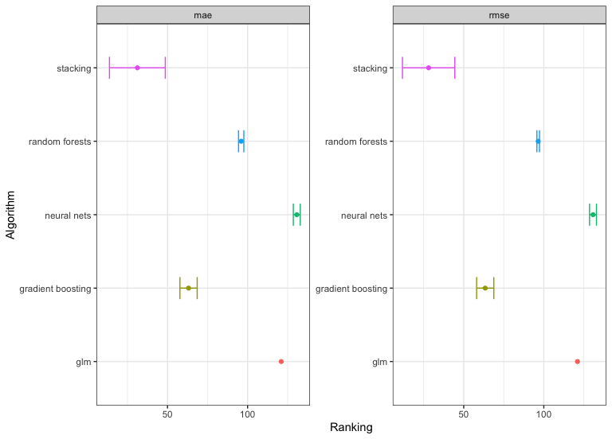

```{r setup, include=FALSE}
knitr::opts_chunk$set(
  collapse = TRUE,
  comment = "#>",
  fig.width = 8,
  fig.height = 5.75,
  out.width = "95%"
)
options(digits = 3)
```

## Introduction 

The `agua` package provides tidymodels interface to the [H2O](https://h2o.ai/) platform and the [h2o](https://docs.h2o.ai/h2o/latest-stable/h2o-r/docs/index.html) R package. It has two main components

-   new parsnip engine `'h2o'` for the following models:

    -   `linear_reg()`, `logistic_reg()`, `poisson_reg()`, `multinom_reg()`: All fit penalized generalized linear models. If the model parameters `penalty` and `mixture` are not specified, h2o will internally search for the optimal regularization settings. 
    
    -   `boost_tree()`: Uses H2O's XGBOOST algorithm. Use `h2o::h2o.xgboost.available()` to see if XGBOOST is supported on your machine. For classical gradient boosting, use the `'h2o_gbm'` engine. 

    -   `auto_ml()`
    
    -   `rand_forest()`
    
    -   `naive_Bayes()`
    
    -   `rule_fit()`
    
    -   `mlp()`
    

-   Infrastructure for the tune package, see [Tuning with agua](https:://agua.tidymodels.org/articles/tune.html) for more details. 

 All supported models can accept an additional engine argument `validation`, which is a number between 0 and 1 specifying the _proportion_ of data reserved as validation set. This can used by h2o for performance assessment and potential early stopping.

## Fitting models with the `'h2o'` engine 

As an example, we will fit a random forest model to the `concrete` data. This will be a regression model with the outcome being the compressive strength of concrete mixtures.

```{r startup, message = FALSE}
library(tidymodels)
library(agua)
tidymodels_prefer()
theme_set(theme_bw())

# start h2o server
h2o_start()

data(concrete, package = "modeldata")
concrete <-
  concrete %>%
  group_by(across(-compressive_strength)) %>%
  summarize(compressive_strength = mean(compressive_strength),
            .groups = "drop")

concrete
```

Note that we need to call `h2o_start()` or `h2o::h2o.init()` to start the h2o instance. The h2o server handles computations related to estimation and prediction, and passes the results back to R. agua takes care of data conversion and error handling, it also tries to store as least objects (data, models) on the server as possible. The h2o will automatically terminate once R session is closed. You can use `h2o::h2o.removeAll()` to remove all server-side objects and `h2o::h2o.shutdown()` to manually stop the server. 

The rest syntax of model fitting and prediction are identical to the usage of any other engine in tidymodels. 

```{r rf-fit}
set.seed(1501)
concrete_split <- initial_split(concrete, strata = compressive_strength)
concrete_train <- training(concrete_split)
concrete_test  <- testing(concrete_split)

rf_spec <- rand_forest(mtry = 3, trees = 500) %>%
  set_engine("h2o", histogram_type = "Random") %>% 
  set_mode("regression")

normalized_rec <-
  recipe(compressive_strength ~ ., data = concrete_train) %>%
  step_normalize(all_predictors())

rf_wflow <- workflow() %>% 
  add_model(rf_spec) %>%
  add_recipe(normalized_rec)
  
rf_fit <- fit(rf_wflow, data = concrete_train)
rf_fit

predict(rf_fit, new_data = concrete_test)
```

Here we specify the engine argument `histogram_type = "Random"` to use the extremely randomized trees (XRT) algorithm. For all available engine arguments, consult the engine specific help page for "h2o" of that model. For instance, the h2o link in the help page of `rand_forest()` shows that it uses `h2o::h2o.randomForest`, whose arguments can be passed as engine arguments in `set_engine()`. 

You can also use `fit_resamples` with h2o models. 

```{r rf-fitresample, eval = FALSE}
concrete_folds <-
  vfold_cv(concrete_train, strata = compressive_strength, repeats = 5)

fit_resamples(rf_wflow, resamples = concrete_folds)
#> # A tibble: 119 × 5
#>    id                                         algor…¹ .metric  .model   .predi…²
#>    <chr>                                      <chr>   <list>   <list>   <list>  
#>  1 StackedEnsemble_BestOfFamily_4_AutoML_5_2… stacki… <tibble> <fit[+]> <tibble>
#>  2 StackedEnsemble_AllModels_2_AutoML_5_2022… stacki… <tibble> <fit[+]> <tibble>
#>  3 StackedEnsemble_BestOfFamily_6_AutoML_5_2… stacki… <tibble> <fit[+]> <tibble>
#>  4 GBM_grid_1_AutoML_5_20220629_160716_model… gradie… <tibble> <fit[+]> <tibble>
#>  5 StackedEnsemble_BestOfFamily_3_AutoML_5_2… stacki… <tibble> <fit[+]> <tibble>
#>  6 StackedEnsemble_AllModels_5_AutoML_5_2022… stacki… <tibble> <fit[+]> <tibble>
#>  7 GBM_5_AutoML_5_20220629_160716             gradie… <tibble> <fit[+]> <tibble>
#>  8 GBM_grid_1_AutoML_5_20220629_160716_model… gradie… <tibble> <fit[+]> <tibble>
#>  9 StackedEnsemble_AllModels_1_AutoML_5_2022… stacki… <tibble> <fit[+]> <tibble>
#> 10 GBM_grid_1_AutoML_5_20220629_160716_model… gradie… <tibble> <fit[+]> <tibble>
#> # … with 109 more rows, and abbreviated variable names ¹​algorithm,
#> #   ²​.predictions
```


## Using H2O AutoML 

Automatic machine learning (AutoML) is the process of automatically searching , screening and evaluating many models for a specific training set. AutoML could be particularly insightful as an first-round exploratory approach to identify model families and parameterization that is most likely to succeed in a given problem. You can use H2O's [AutoML](https://docs.h2o.ai/h2o/latest-stable/h2o-docs/automl.html) algorithm via the `'h2o'` engine in `auto_ml()`. Additionally, ague provides several helper functions to quickly wrangle and visualize AutoML's results. 

Let's run an AutoML search on the concrete data. 

```{r auto-fit, eval = FALSE}
# run for a maximum of 120 seconds
auto_spec <-
  auto_ml() %>%
  set_engine("h2o", max_runtime_secs = 120, seed = 1) %>%
  set_mode("regression")

auto_wflow <-
  workflow() %>%
  add_model(auto_spec) %>%
  add_recipe(normalized_rec)

auto_fit <- fit(auto_wflow, data = concrete_train)
auto_fit %>% extract_fit_parsnip()
#> parsnip model object
#>
#> ═══════════════ H2O AutoML Summary: 119 models ══════════════ 
#> Leader Algorithm: stackedensemble
 
#> Leader ID: StackedEnsemble_BestOfFamily_4_AutoML_5_20220629_160716
#>  
#> ══════════════════════════════════ Leaderboard ═════════════════════════════════ 
#>                                                  model_id rmse  mse  mae rmsle
#> 1 StackedEnsemble_BestOfFamily_4_AutoML_5_20220629_160716 4.29 18.4 2.98 0.137
#> 2    StackedEnsemble_AllModels_2_AutoML_5_20220629_160716 4.29 18.4 2.94 0.134
#> 3 StackedEnsemble_BestOfFamily_6_AutoML_5_20220629_160716 4.30 18.5 2.99 0.138
#> 4            GBM_grid_1_AutoML_5_20220629_160716_model_37 4.31 18.6 3.00 0.139
#> 5 StackedEnsemble_BestOfFamily_3_AutoML_5_20220629_160716 4.36 19.0 2.99 0.137
#> 6    StackedEnsemble_AllModels_5_AutoML_5_20220629_160716 4.37 19.1 2.97 0.143
#>   mean_residual_deviance
#> 1                   18.4
#> 2                   18.4
#> 3                   18.5
#> 4                   18.6
#> 5                   19.0
#> 6                   19.1
```


In 120 seconds, AutoML fitted 119 candidate models and returned a leaderboard of all model's cross validation performances. `model_id` is the model's identifier on the h2o server, you can retrieve any model with an id using `extract_fit_parsnip(mod, id = id)` and predict with it. By default, this extracts the best performing one. 

```{r auto-predict, eval = FALSE}
extract_fit_parsnip(auto_fit) %>%
  predict(new_data = concrete_test)
#> # A tibble: 249 × 1
#>    .pred
#>    <dbl>
#>  1 100. 
#>  2 101. 
#>  3  91.9
#>  4  96.5
#>  5 103. 
#>  6 122. 
#>  7  95.0
#>  8 134. 
#>  9 109. 
#> 10  92.9
#> # … with 239 more rows
```

agua includes tools to work with AutoML results:

- `rank_results_automl` returns the leaderboard in tidy format with rankings within each metric

```{r auto-rank, eval = FALSE}
rank_results_automl(auto_fit) %>%
  filter(.metric == "mae") %>% 
  arrange(rank)
#> # A tibble: 119 × 5
#>    id                                                algor…¹ .metric  mean  rank
#>    <chr>                                             <chr>   <chr>   <dbl> <int>
#>  1 StackedEnsemble_AllModels_2_AutoML_5_20220629_16… stacki… mae      2.94     1
#>  2 StackedEnsemble_AllModels_5_AutoML_5_20220629_16… stacki… mae      2.98     2
#>  3 GBM_5_AutoML_5_20220629_160716                    gradie… mae      2.98     3
#>  4 StackedEnsemble_BestOfFamily_4_AutoML_5_20220629… stacki… mae      2.98     4
#>  5 StackedEnsemble_BestOfFamily_3_AutoML_5_20220629… stacki… mae      2.98     5
#>  6 StackedEnsemble_BestOfFamily_6_AutoML_5_20220629… stacki… mae      2.99     6
#>  7 GBM_grid_1_AutoML_5_20220629_160716_model_37      gradie… mae      3.00     7
#>  8 GBM_grid_1_AutoML_5_20220629_160716_model_35      gradie… mae      3.06     8
#>  9 StackedEnsemble_AllModels_1_AutoML_5_20220629_16… stacki… mae      3.07     9
#> 10 GBM_grid_1_AutoML_5_20220629_160716_model_70      gradie… mae      3.07    10
#> # … with 109 more rows, and abbreviated variable name ¹​algorithm
```


- `collect_metrics` returns average statistics of performance metrics (summarized) per model, or raw value in each resample (unsummarized).

```{r auto-metrics, eval = FALSE}
collect_metrics(auto_fit, summarize = FALSE)
#> # A tibble: 4,215 × 5
#>    id                                              algor…¹ .metric cv_id .esti…²
#>    <chr>                                           <chr>   <chr>   <chr>   <dbl>
#>  1 StackedEnsemble_BestOfFamily_4_AutoML_5_202206… stacki… mae     cv_1…    2.67
#>  2 StackedEnsemble_BestOfFamily_4_AutoML_5_202206… stacki… mae     cv_2…    2.96
#>  3 StackedEnsemble_BestOfFamily_4_AutoML_5_202206… stacki… mae     cv_3…    2.86
#>  4 StackedEnsemble_BestOfFamily_4_AutoML_5_202206… stacki… mae     cv_4…    3.31
#>  5 StackedEnsemble_BestOfFamily_4_AutoML_5_202206… stacki… mae     cv_5…    3.09
#>  6 StackedEnsemble_BestOfFamily_4_AutoML_5_202206… stacki… mean_r… cv_1…   15.7 
#>  7 StackedEnsemble_BestOfFamily_4_AutoML_5_202206… stacki… mean_r… cv_2…   17.5 
#>  8 StackedEnsemble_BestOfFamily_4_AutoML_5_202206… stacki… mean_r… cv_3…   17.7 
#>  9 StackedEnsemble_BestOfFamily_4_AutoML_5_202206… stacki… mean_r… cv_4…   24.4 
#> 10 StackedEnsemble_BestOfFamily_4_AutoML_5_202206… stacki… mean_r… cv_5…   16.6 
#> # … with 4,205 more rows, and abbreviated variable names ¹​algorithm, ²​.estimate
```

- `tidy()` returns a tibble with performance and individual model objects. This is helpful if you just want to perform some operations (i.e., predict) on all candidates. 

```{r auto-tidy, eval = FALSE}
tidy(auto_fit) %>%
  mutate(
    .predictions = purrr::map(.model, predict, new_data = head(concrete_test))
  )
#> # A tibble: 119 × 5
#>    id                                         algor…¹ .metric  .model   .predi…²
#>    <chr>                                      <chr>   <list>   <list>   <list>  
#>  1 StackedEnsemble_BestOfFamily_4_AutoML_5_2… stacki… <tibble> <fit[+]> <tibble>
#>  2 StackedEnsemble_AllModels_2_AutoML_5_2022… stacki… <tibble> <fit[+]> <tibble>
#>  3 StackedEnsemble_BestOfFamily_6_AutoML_5_2… stacki… <tibble> <fit[+]> <tibble>
#>  4 GBM_grid_1_AutoML_5_20220629_160716_model… gradie… <tibble> <fit[+]> <tibble>
#>  5 StackedEnsemble_BestOfFamily_3_AutoML_5_2… stacki… <tibble> <fit[+]> <tibble>
#>  6 StackedEnsemble_AllModels_5_AutoML_5_2022… stacki… <tibble> <fit[+]> <tibble>
#>  7 GBM_5_AutoML_5_20220629_160716             gradie… <tibble> <fit[+]> <tibble>
#>  8 GBM_grid_1_AutoML_5_20220629_160716_model… gradie… <tibble> <fit[+]> <tibble>
#>  9 StackedEnsemble_AllModels_1_AutoML_5_2022… stacki… <tibble> <fit[+]> <tibble>
#> 10 GBM_grid_1_AutoML_5_20220629_160716_model… gradie… <tibble> <fit[+]> <tibble>
#> # … with 109 more rows, and abbreviated variable names ¹​algorithm,
#> #   ²​.predictions
```

- `member_weights()` computes variable importance for all stacked ensemble models, i.e., the relative importance of base models in the meta-learner. This is typically the coefficient magnitude in the second-level GLM model. Here we show the scaled contribution of different algorithms in these stacking models. 

```{r auto-stacked, eval = FALSE}
auto_fit %>% 
  extract_fit_parsnip() %>% 
  member_weights() %>% 
  tidyr::unnest(importance) %>%
  filter(type == "scaled_importance") %>% 
  ggplot() + 
  geom_boxplot(aes(value, algorithm)) +
  scale_x_sqrt() + 
  labs(y = NULL, x = "scaled importance", title = "Variable importance in stacked ensembles")
```


```{r, echo = FALSE}
knitr::include_graphics("auto-stacked-1.png")
```

You can also `autoplot()` on an AutoML object, which wraps functions above to plot
performance assessment and ranking. The lower the average ranking, the more likely the model type suits the data. 

```{r autoplot, eval = FALSE}
autoplot(auto_fit, type = "rank", metric =c("mae", "rmse")) + 
  theme(legend.position = "none")
```

```{r, echo = FALSE}

```

One current limitation of H2O AutoML models is that they can't be used in tidymodels
resampling mechanism. This means you can't use them with `fit_resamples()`, `tune_grid()`, `tune_bayes()`, etc. 
