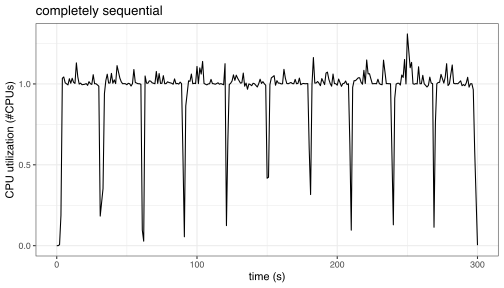
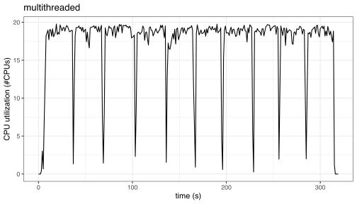
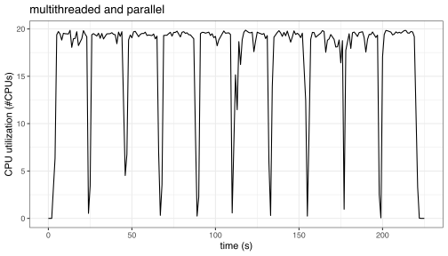
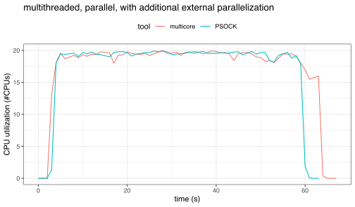

  
When using h2o with R there are, generally speaking, different ways to parallelize the computations: 

* The h2o server has the ability to internally parallelize individual model computations. For example, when fitting trees, the search for the best split can be done using multiple threads. 

* R has external parallelization tools (such as the foreach and future packages) that can start new R processes to simultaneously do work. This would run many models in parallel. 

With h2o and tidymodels, you can use either approach or both. We'll discuss the different options

There are code recommendations at the end. 

## Within-model parallelization with h2o

[`h2o.init()`](https://docs.h2o.ai/h2o/latest-stable/h2o-docs/starting-h2o.html#from-r) has an option called `nthreads`: 

> `nthreads`: (Optional) Number of threads in the thread pool. This relates very closely to the number of CPUs used. -1 means use all CPUs on the host (Default). A positive integer specifies the number of CPUs directly. This value is only used when R starts H2O.

You can use that to specify how many resources are used to train a model. This helps speed up a specific model fit. For example, when a tree-based model is used, the search for the best variable/split point can be parallel processed. 

## Between-model parallelization

When tuning or resampling, agua processes the data and sends computations to the h2o server in chunks based on the data set. In other words, if there are _B_ data sets created during resampling, agua sends all of the grid configurations for that data set to the h2o server at the same time. For example, if a grid of 7 tuning parameter combinations were resampled with _B_ 20 bootstraps, the 140 models are processed in chunks of 20.

While the h2o server can process multiple models at once, it does not bey default. If you were using h2o directly, the [`h2o.grid()`](https://docs.h2o.ai/h2o/latest-stable/h2o-docs/grid-search.html) function controls how many can be simultaneously fit via the `parallelism` argument (emphasis added): 

> `parallelism`: Level of Parallelism during grid model building. 1 = __sequential building (default)__. Use the value of 0 for adaptive parallelism - decided by H2O. Any number > 1 sets the exact number of models built in parallel.

tidymodels users don't call `h2o.grid()` directly so we've added a new tidymodels control argument called `backend_options`. If you were doing a grid search, you first define how many processors that the h2o server should use:

```r
library(tidymodels)
library(agua)
library(finetune)

# Suppose your computer (or the server) has 10 CPUs:
h2o_cpu_spec <- agua_backend_options(parallelism = 10) 
```

then pass this to any of the existing control functions: 

```r
grid_ctrl <- control_grid(backend_options = h2o_cpu_spec)
```

This can be used when using grid search, racing, or any of the iterative search methods in tidymodels. 

## External parallelization

As mentioned above, agua sends all the tuning parameter configurations for a specific data set to the h2o server at the same time. 

You can also send multiple data sets (i.e. resamples) to the h2o server simultaneously using _external parallelization_ tools like the foreach or future package (tidymodels currently uses foreach). 

With foreach, users load an extension package such as doMC or doParallel. The former uses multicore technology and does not work on Windows. The latter uses PSOCK clusters and is available on all operating systems. Let's look at each. 

### Multicore

To get started, you would install the doMC package and register the parallel backend. 

```r
available_cores <- parallel::detectCores()

library(doMC)
registerDoMC(cores = available_cores)
```

Using this, agua will send multiple model fits to the "worker processes" at the same time and seamlessly bring the results back to your R session. 

When the worker processes are created they inherit much of what was going on in your R process. This includes which packages are loaded as well as the information on the h2o server. Basically, it takes care of the background minutiae. 

### doParallel 

PSOCK clusters are usually higher maintenance for users and developers. To start, a cluster object is created and then registered as the parallel backend: 

```r
available_cores <- parallel::detectCores()

library(doParallel)
cl <- makePSOCKcluster(available_cores)
registerDoParallel(cl)
```

However, due to how these clusters work, their R processes start with a clean slate and don't know anything about the h2o server or what packages should be loaded. 

For this reason, we need to run some code on the worker processes to "prime the pump":

```r
check_workers_h2o <- function() {
  library(h2o)
  h2o.init()  #<- doesn't start a new server if you've already started one. 
  h2o.clusterIsUp()
}

unlist(parallel::clusterCall(cl, check_workers_h2o))
```

This should return a vector of `TRUE` values if everything is appropriately setup. 

From there, you can run your tidymodels code as usual. 

Now that we've described three different approaches, let's look at how well they work. The next section is based on the results from [this GitHub repository](https://github.com/topepo/agua-h2o-benchmark). 

## Benchmarks

A simulated data set was tuned over a small grid of 5 candidate models and model performance was measured using 10-fold cross-validation. This means that a total of 50 models were created during tuning. 

The computer is an iMacPro with 10 Intel chips running R version 4.2.0 (2022-04-22). Note that, with Intel chips, [hyper-threading](https://en.wikipedia.org/wiki/Hyper-threading) enables twice the number of simultaneous processes to be run at once. In the plots below, maximum CPU usage corresponds to 20 CPUs. The [Syrupy](https://github.com/jeetsukumaran/Syrupy) python library was used to monitor CPU usage. 

### Computational methods

The computations were run in a few different ways: 

* __Completely sequential processing__. The idea was to have the h2o server use a single thread to process the models. The file `sequential.R` used `h2o.init(nthreads = 1)` to do this. Implicitly, `h2o.grid()` has a default that models are processed sequentially. 

* __Multithreaded processing__: The server was configured to use all CPUs on the host via `h2o.init(nthreads = -1)` while `h2o.grid()` is still set to sequential processing. This code is in `multithreaded.R`. 

* __Multithreaded parallel processing__: Along with `h2o.init(nthreads = -1)`, the calls to the h2o server used `h2o.grid(parallelism = 5)` so that a maximum of 5 models (i.e. the entire grid) could be processed at once. 

* __Multithreaded, multicore parallel processing__: Along with `h2o.init(nthreads = -1)`, the calls to the h2o server used `h2o.grid(parallelism = 50)`. In additional, multicore parallel processing via the foreach and doMC packages were used to send all of the candidate models for all resamples to the server at once. 

* __Multithreaded, PSOCK parallel processing__: Along with `h2o.init(nthreads = -1)`, the calls to the h2o server used `h2o.grid(parallelism = 50)`. Here, parallel processing was enabled via the foreach and doParallel packages (using a PSOCK cluster) to achieve similar results


### Results

When the baseline configuration of single threaded, sequential processing was used the execution time for the grid search was 296.6 seconds. The pattern of CPU usage was:



The 10 clusters of high utilization correspond to the h2o server processing the 5 candidate models for each of the 10 resamples. CPU utilization is about 1, as expected. 

Once multiple threads were allowed, the grid search lasted 311 seconds (slightly slower than the baseline). Looking at the `Rout` file, the output lists that

```
    H2O cluster total cores:    20 
    H2O cluster allowed cores:  20 
```

so it is unclear why the processing was relatively slow. The usage graph: 



All 20 possible (logical) cores are being used. 

Once we allow the h2o server to train multiple models at once, the grid search lasted 218.5 seconds (a 1.4-fold speed-up): 



Once we used the foreach package to send all the jobs to the h2o server at once, there was an drop in execution time: 62.9 seconds for muticore and 63.3 seconds using a PSOCK cluster. These correspond to speed-ups of 63-fold. 

The CPU utilization graph for both external parallelization methods show constant utilization since all 50 models are being continually processed: 



The contrast between speed-ups for within- and between-model parallelism make sense; we want to parallelize the longest running "loop". A similar study using caret showed similar results. See the blog post [_While you wait for that to finish, can I interest you in parallel processing?_](http://appliedpredictivemodeling.com/blog/2018/1/17/parallel-processing) for an example using caret and xgboost. 

## Recommendations

For best performance, we would suggest using external parallelism. Here is some example code that you could use:

```r
library(tidymodels)
library(agua)
library(h2o)
library(doParallel)

# ------------------------------------------------------------------------------

cores <- parallel::detectCores(logical = TRUE)

h2o.init(nthreads = -1)
h2o_cpu_spec <- agua_backend_options(parallelism = cores)

# ------------------------------------------------------------------------------

cl <- makePSOCKcluster(cores)
registerDoParallel(cl)

# Prime the worker processes
check_workers_h2o <- function() {
  library(h2o)
  h2o.init()  
  h2o.clusterIsUp()
}
unlist(parallel::clusterCall(cl, check_workers_h2o))

# ------------------------------------------------------------------------------

# Use this (or an appropriate `control_*()` function) with the `tune_*()`
# functions or `fit_resamples()`: 

grid_ctrl <- control_grid(backend_options = h2o_cpu_spec)

# ------------------------------------------------------------------------------

# Do your model tuning here. For example: 

res <- model %>% tune_grid(resamples, control = grid_ctrl)

# ------------------------------------------------------------------------------

# After finishing your work, make sure to stop the cluster

stopCluster(cl)

```

